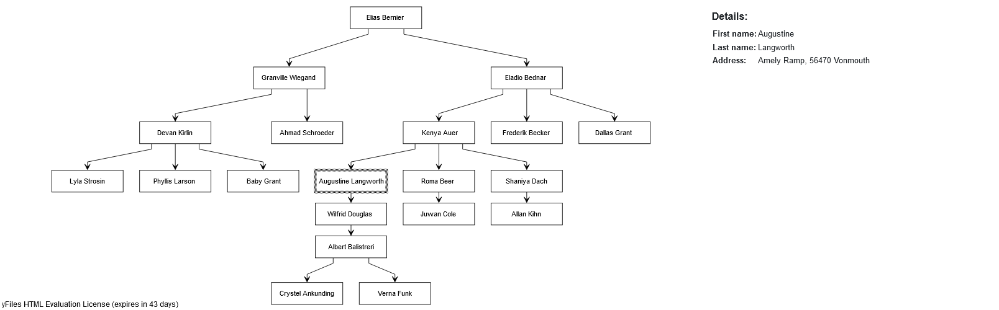

# yFiles for HTML with Blazor WebAssembly

## Quick Start

1. Clone the repository.
2. place your license top level in the project
3. In `frontend` run `npm install`
4. In `frontend` run `npm run build`
5. Top level in the project, run `dotnet watch`

## Step-by-Step Setup

This tutorial helps you to create a simple [Blazor](https://blazor.net) WebAssembly web app containing a yFiles [`GraphComponent`](https://docs.yworks.com/yfileshtml/#/api/GraphComponent). The app calls a TypeScript API from a Blazor service, which communicates with the yFiles API. The app creates random people, puts them in a hierarchy and outputs a layouted graph. When clicking a node, the app shows details about the corresponding person. The result looks as follows:



This walkthrough will teach you

* how to use TypeScript in Blazor.
* how to call the yFiles API by using TypeScript wrapper functions.
* how to connect to TypeScript and call TypeScript functions from C#.
* how to create a hierarchy and load it into a graph.
* how to call C# methods from TypeScript.
* how to use Razor components and data binding for viewing data related to nodes.

### Table of contents

* [Setting up the project](#setting-up-the-project)
    * [Requirements](#requirements)
    * [Creating the project](#creating-the-project)
    * [Installing TypeScript](#installing-typescript)
    * [Installing yFiles](#installing-yfiles)
    * [Installing Vite](#installing-vite)
    * [Developing with `tsc` and `dotnet`](#developing-with-tsc-and-dotnet)
* [Adding a `GraphComponent`](#adding-a-graphcomponent)
    * [The general architecture of the project](#the-general-architecture-of-the-project)
    * [Creating the TypeScript functions](#creating-the-typescript-functions)
    * [Creating the Blazor service](#creating-the-blazor-service)
    * [Using the service in a Razor component](#using-the-service-in-a-razor-component)
* [Communication between C# and TypeScript](#communication-between-c-and-typescript)
    * [Creating nodes](#creating-nodes)
    * [Creating edges](#creating-edges)
    * [Applying a layout](#applying-a-layout)
    * [Further communication](#further-communication)
* [Creating a graph](#creating-a-graph)
    * [Creating a hierarchy](#creating-a-hierarchy)
    * [Converting the hierarchy to a graph](#converting-the-hierarchy-to-a-graph)
* [Viewing the data associated with a node](#viewing-the-data-associated-with-a-node)
    * [Calling .NET methods from TypeScript](#calling-net-methods-from-typescript)
    * [Viewing the data of the selected person](#viewing-the-data-of-the-selected-person)
* [Conclusion](#conclusion)

### Setting up the project

#### Requirements

For development, you will need an IDE. In this tutorial, the CLI (.NET 7) will be used so that code editors such as [Visual Studio Code](https://code.visualstudio.com/download) can be used too.
Hence, [.NET](https://dotnet.microsoft.com/en-us/download/dotnet) is required.
Furthermore, you need to have [Node.js](https://nodejs.org/en/download/) installed.

#### Creating the project

If you want to add yFiles to an existing project, just skip this section.

Let's start by creating a new Blazor WebAssembly app. First, create a new directory. Then, run `dotnet new blazorwasm` in your project's directory. This will create the default app, which uses the [`blazorwasm`](https://docs.microsoft.com/en-us/dotnet/core/tools/dotnet-new-sdk-templates#blazorwasm) template. To start the project, run `dotnet watch`. This will enable hot reload, which allows you to view your changes directly in the browser without having to recompile manually.

In the browser, the app should look something like this:


Go ahead and create the following elements:

* folder `frontend`
* file `frontend/src/app.ts`
* file `frontend/src/index.ts` and paste the content of [index.ts](frontend/index.ts)
* file `frontend/index.html` and paste the content of [index.html](frontend/index.html)

The `index.ts` makes any exported method in `app.ts` available on `window`
```js
import * as functions from './app'
// provide any exported functions on window
Object.assign(window, functions)
```

 and is then referenced in the `index.html` file:

```html
<script type="module" src="src/index.ts"></script>
```

#### Installing TypeScript

In order to setup TypeScript, navigate into `frontend` and run

```
npm init
npm install typescript
```

TypeScript needs a config file `frontend/tsconfig.json` containing

```json
{
  "compilerOptions": {
    "target": "ESNext",
    "useDefineForClassFields": true,
    "module": "ESNext",
    "lib": ["ESNext", "DOM"],
    "moduleResolution": "Node",
    "strict": true,
    "sourceMap": true,
    "resolveJsonModule": true,
    "isolatedModules": true,
    "esModuleInterop": true,
    "noEmit": true,
    "noUnusedLocals": true,
    "noUnusedParameters": true,
    "noImplicitReturns": true,
    "skipLibCheck": true
  },
  "include": ["src"]
}

```

#### Installing yFiles

yFiles can be installed via npm. In folder `frontend` run

```
npm install --save <path to yfiles tgz file>
```

Place a copy of your yFiles license inside the project folder.

#### Installing Vite

To build yFiles, we use the bundler [Vite](https://vitejs.dev).
Use npm in `frontend` again to install it:

```
npm install vite
```

Vite needs a bit of configuration too.
To declare build scripts, add the following to `package.json`:

```
"scripts": {
  "dev": "vite",
  "build": "tsc && vite build",
  "watch": "vite build --watch",
  "preview": "vite preview"
}
```

Furthermore we need to specify the output directory where Vite shall place the compiled files.
In our case this is the `wwwroot` folder which will be created one folder above `frontend` after the first build and serves as root of the website.
Optionally, you can set a watch to the build config which automatically rebuilds on every change in the TypeScript source files.
Therefore, create a file `frontend/vite.config.js` and add

```js
export default {
    build: {
        outDir: '../wwwroot',
        emptyOutDir: true,
        minify: false,
        watch: {}
    }
}
```

With `emptyOutDir: true` the content of `wwwroot` folder gets cleared on every build.
Afterwards, `index.html` will be copied to `wwwroot` and the yFiles library will be bundled into `wwwroot/assets`.

#### Developing with `tsc` and `dotnet`

Changes made in the TypeScript files won't affect the behaviour of the application. To watch for changes, start Vite's file watcher by calling `npm run watch` which automatically transpiles the files to JavaScript.

Now that everything is set up, we can start implementing the yFiles `GraphComponent`.

### Adding a `GraphComponent`

Let's add a `GraphComponent` to a Razor component.

#### The general architecture of the project

As we want to initialize the graph, add nodes and edges to it, etc. from C#, we need to call TypeScript functions using [`IJSRuntime`](https://docs.microsoft.com/en-us/dotnet/api/microsoft.jsinterop.ijsruntime?view=aspnetcore-6.0), which then call the yFiles API and modify the graph. Hence, we will create a [Blazor service](https://docs.microsoft.com/en-us/aspnet/core/blazor/fundamentals/dependency-injection?view=aspnetcore-6.0) that does all the communication with TypeScript and that we will then call from a component to build a graph. Furthermore, we need to write TypeScript wrapper functions for all the yFiles features we want to use.

#### Creating the TypeScript functions

Note: this will just give you a quick walk through generating a graph with yFiles.
For details, please refer to our [Getting Started](https://docs.yworks.com/yfileshtml/#/dguide/getting_started). 

Let's start by initializing the `GraphComponent`. But first, we have to import the yFiles license in `frontend/src/app.ts`.

```ts
import {
    License
} from 'yfiles';

License.value = {
    /* <your license data here> */
}
```

Then we declare a function which instantiates a `GraphComponent` in `app.ts`:

```TypeScript
export function initializeGraph(selector: string) {
    const gc = new GraphComponent(selector);
    gc.inputMode = new GraphViewerInputMode();
}
```

On the `window` instance, we create a new function which takes in a `selector` string for the `GraphComponent`. After creating the `GraphComponent` and storing the Graph, we apply a [`GraphViewerInputMode`](https://docs.yworks.com/yfileshtml/#/api/GraphViewerInputMode) to the `GraphComponent`. That way, we can interact with the graph later on.

Since the function is registered on `window`, we can call it from the Blazor service.

#### Creating the Blazor service

A Blazor service is a C# class. Blazor creates one instance of that class, which can then be injected into other services or components.

Let's now create the service that communicates with JavaScript at runtime. Set up a class `CommunicatorService` in `Shared/CommunicatorService.cs`:

```C#
using Microsoft.JSInterop;

namespace yFilesWASM.Communicator;

public class CommunicatorService
{

    // 'JS' is used to invoke JavaScript functions.
    private readonly IJSRuntime JS;

    // Blazor will automatically provide an instance of 'IJSRuntime' as an injection.
    public CommunicatorService(IJSRuntime js)
    {
        this.JS = js;
    }

    // This method invokes the 'initializeGraph' function.
    public async Task InitializeGraphAsync(string selector)
    {
        await JS.InvokeVoidAsync("initializeGraph", selector);
    }
}
```

As you can see, the `selector` string is passed to the `initializeGraph` function by calling `InvokeVoidAsync` on `JS`.

Now, the service has to be registered as a singleton in `Program.cs`:

```C#
// Using the namespace for the 'CommunicatorService'.
using yFilesWASM.Communicator;

...

var builder = WebAssemblyHostBuilder.CreateDefault(args);

...

// Adding 'CommunicatorService' as a singleton.
builder.Services.AddSingleton<CommunicatorService>();

...

await builder.Build().RunAsync();

```

#### Using the service in a Razor component

The `selector` string specifies the `div` element that yFiles should use for rendering the graph. That's why we first have to add a `div` element to the component in `Pages/Index.razor`:

```HTML
<div id="graphComponent" style="height: 100%; width: 100%;"></div>
```

The height and the width of the `div` need to be set.

In order to call the JavaScript functions, we need an instance of the `CommunicatorService` using a dependency injection:

```C#
@using yFilesWASM.Communicator
@inject CommunicatorService communicator
```

We want to initialize the graph after the component is rendered. Thus, let's override the `OnAfterRenderAsync` method:

```C#
@code {
    protected override async Task OnAfterRenderAsync(bool firstRender)
    {
        if (firstRender)
        {
            await communicator.InitializeGraphAsync("#graphComponent");
        }
    }
}
```

The final Razor component should look like this now:

```C#
@page "/"
@using yFilesWASM.Communicator
@inject CommunicatorService communicator

<div id="graphComponent" style="height: 100%; width: 100%;"></div>

@code {
    protected override async Task OnAfterRenderAsync(bool firstRender)
    {
        if (firstRender)
        {
            await communicator.InitializeGraphAsync("#graphComponent");
        }
    }
}
```

To simplify the overall page layout, remove the `DefaultLayout` of the main route in `/App.razor` like so:
```XML
<Router AppAssembly="@typeof(App).Assembly">
    <Found Context="routeData">
        <RouteView RouteData="@routeData" />
        <FocusOnNavigate RouteData="@routeData" Selector="h1" />
    </Found>
    <NotFound>
        <PageTitle>Not found</PageTitle>
        <LayoutView Layout="@typeof(MainLayout)">
            <p role="alert">Sorry, there's nothing at this address.</p>
        </LayoutView>
    </NotFound>
</Router>
```

The result shpuld look as follows:


There isn't much to see yet and interaction is limited to viewing since `inputMode` is set to an instance of `GraphViewerInputMode`, however note the yFiles license text in the bottom of the `GraphComponent`. This indicates that yFiles is up and running.

### Communication between C# and TypeScript

#### Creating nodes

Now that we successfully added a `GraphComponent` to the view, let's programmatically create nodes.

So first, we will need to add a new TypeScript function in `app.ts`:

```TypeScript
interface Rect {
    x: number,
    y: number,
    width: number,
    height: number
}

// 'nodes' keeps the ids with the corresponding nodes.
const nodes: [number, INode][] = [];

let nodeIdCount = 0;
export function createNode(label: string, rect: Rect | null): number {
    // Create a rect at the specified position with the specified width and height.
    const node = rect === null 
        ? graph.createNode()
        : graph.createNode(new yRect(rect.x, rect.y, rect.width, rect.height));
    
    // Add a label to the node.
    graph.addLabel(node, label);

    // Assign an id to the node, store it and return the id.
    let id = nodeIdCount++;
    nodes.push([id, node]);
    return id;
}
```

The function takes in a label and a `Rect`, which specifies the position and size of the node. If `rect` is `null`, no position and size are passed when calling [`createNode`](https://docs.yworks.com/yfiles-html/api/IGraph.html#createNode(layout,style,tag)). Additionally, we create an id for the node, which can later be used in C# to reference a node.

Now, we still need to add logic to the `CommunicatorService`:

```C#
// This method invokes the 'createNode' function.
public async Task<int> CreateNodeAsync(string label, Rect? rect)
{
    return await JS.InvokeAsync<int>("createNode", label, rect);
}
```

`CreateNodeAsync` returns the id of the newly created node.

As you can see, there is a reference to `Rect` in `CreateNodeAsync`, which will be specified in a new file `Rect.cs`:

```C#
namespace yFilesWASM.Communicator;

public struct Rect
{
    public double X { get; set; }
    public double Y { get; set; }
    public double Width { get; set; }
    public double Height { get; set; }

    public Rect(double x, double y, double width, double height)
    {
        this.X = x;
        this.Y = y;
        this.Width = width;
        this.Height = height;
    }
}
```

The `Rect` struct in `Rect.cs` has exactly the same properties (apart from capitalization) as the `Rect` interface in `app.ts`. Thus, Blazor is able to serialize the `rect` passed to the TypeScript function in `CreateNodeAsync` and TypeScript can then read it as an object of the type `Rect`. Generally, you can use any JSON-serializable object as an argument of [`InvokeAsync<T>`](https://docs.microsoft.com/en-us/dotnet/api/microsoft.jsinterop.jsruntime.invokeasync?view=aspnetcore-6.0) or [`InvokeVoidAsync`](https://docs.microsoft.com/en-us/dotnet/api/microsoft.jsinterop.jsruntimeextensions.invokevoidasync?view=aspnetcore-6.0). Since `rect` in `CreateNodeAsync` is nullable, we can provide `null` as a valid argument and omit custom positioning.
`InvokeAsync<T>` is generic and returns the return value of the TypeScript function by parsing it to the type `T`.

Let's add some hard coded nodes from our Razor component in the `OnAfterRenderAsync` method to test our code:

```C#
protected override async Task OnAfterRenderAsync(bool firstRender)
{
    if (firstRender)
    {
        await communicator.InitializeGraphAsync("#graphComponent");

        // Adding some nodes.
        int nodeId1 = await communicator.CreateNodeAsync("Hello world!", new Rect(100, 200, 30, 70));
        int nodeId2 = await communicator.CreateNodeAsync("", null);
        for (var i = 0; i < 5; i++)
        {
            await communicator.CreateNodeAsync(i.ToString(), new Rect((i + 1) * 50, 20 * i, 40, 20));
        }
    }
}
```

Our resulting graph looks as follows:


#### Creating edges

For the edges, it is a similar procedure as with the nodes. First, add a TypeScript function:

```TypeScript
// Function, which returns the corresponding node to an id.
function getNodeFromId(id: number): INode | undefined {
    for (let i of nodes) {
        if (i[0] === id) {
            return i[1];
        }
    }
    return undefined;
}

export function createEdge(nodeId1: number, nodeId2: number) {
    // Get the nodes from the ids:
    const node1 = getNodeFromId(nodeId1);
    const node2 = getNodeFromId(nodeId2);

    // Add an edge if the nodes exist.
    if (node1 !== undefined && node2 !== undefined) {
        graph.createEdge(node1, node2);
    }
}
```

The function calls [`createEdge`](https://docs.yworks.com/yfiles-html/api/IGraph.html#createEdge(sourcePort,targetPort,style,tag)) with the nodes as paramters. Since we stored the nodes' ids in `nodes`, we can now get the corresponding nodes to create edges.

Then, add these lines of code to the `CommunicatorService`:

```C#
// This method invokes the 'createEdge' function.
public async Task CreateEdgeAsync(int nodeId1, int nodeId2)
{
    await JS.InvokeVoidAsync("createEdge", nodeId1, nodeId2);
}
```

Test the code in the Razor component:

```C#
protected override async Task OnAfterRenderAsync(bool firstRender)
{
    if (firstRender)
    {
        await communicator.InitializeGraphAsync("#graphComponent");

        // Adding some nodes and edges.
        int nodeId1 = await communicator.CreateNodeAsync("Hello world!", new Rect(100, 200, 30, 70));
        int nodeId2 = await communicator.CreateNodeAsync("", null);
        await communicator.CreateEdgeAsync(nodeId1, nodeId2);
        
        for (var i = 0; i < 5; i++)
        {
            int nodeId = await communicator.CreateNodeAsync(i.ToString(), new Rect((i + 1) * 50, 20 * i, 40, 20));
            await communicator.CreateEdgeAsync(nodeId, nodeId1);
        }
    }
}
```

And the result:


#### Applying a layout

yFiles provides some [Automatic layouts](https://docs.yworks.com/yfiles-html/dguide/layout/layout-applying_a_layout.html). We will use the [Hierarchic Layout](https://docs.yworks.com/yfiles-html/api/HierarchicLayout.html) here, as this will come in handy later on.

In the `app.ts` file, add:

```TypeScript
// make sure layout module is loaded
Class.ensure(LayoutExecutor)

export function applyHierarchicLayout() {
    // Applying a hierarchic layout in an animated fashion.
    gc.morphLayout({
        layout: new HierarchicLayout(),
        morphDuration: '0.2s'
    });
}
```

Then, add to the `CommunicatorService`:

```C#
// This method invokes the 'applyHierarchicLayout' function.
public async Task ApplyHierarchicLayout()
{
    await JS.InvokeVoidAsync("applyHierarchicLayout");
}
```

Finally, call the method from the Razor component:

```C#
protected override async Task OnAfterRenderAsync(bool firstRender)
{
    if (firstRender)
    {
        await communicator.InitializeGraphAsync("#graphComponent");

        // Adding some nodes and edges.
        int nodeId1 = await communicator.CreateNodeAsync("Hello world!", new Rect(100, 200, 30, 70));
        int nodeId2 = await communicator.CreateNodeAsync("", null);
        await communicator.CreateEdgeAsync(nodeId1, nodeId2);

        for (var i = 0; i < 5; i++)
        {
            int nodeId = await communicator.CreateNodeAsync(i.ToString(), new Rect((i + 1) * 50, 20 * i, 40, 20));
            await communicator.CreateEdgeAsync(nodeId, nodeId1);
        }

        // Apply a hierarchic layout.
        await communicator.ApplyHierarchicLayout();
    }
}
```

We get the following result:


#### Further communication

As you have seen in this section, the procedure to communicate with yFiles is always the same. Thus, implementing new functionality using the feature-rich yFiles API is very easy. As the purpose of this walkthrough is not to explain the yFiles API, please refer to the [online documentation](https://docs.yworks.com/yfiles-html/index.html) for further reading. 

### Creating a graph

#### Creating a hierarchy

Now that we have implemented the basic structure to communicate with yFiles via a Razor component, let's create a more dynamic graph than the hard coded we had before.
For that, we will create a hierarchy of people and then display it as a graph. In order to get random names, we will be using [Faker.Net](https://github.com/Kuree/Faker.Net). The library can be installed easily using nuget:

```
dotnet add package Faker.Net
```

Then, create a new file `Person.cs`, which contains a class that keeps the name and the address of a person:

```C#
using Faker;

namespace yFilesWASM.Hierarchy;

public class Person
{
    public string FirstName { get; set; }
    public string LastName { get; set; }
    public string Address { get; set; }

    public Person()
    {
        // Construct a new person with a random name and a random address from Faker.Net.
        this.FirstName = Name.First();
        this.LastName = Name.Last();
        this.Address = $"{Faker.Address.StreetName()}, {Faker.Address.ZipCode()} {Faker.Address.City()}";
    }

    public override string ToString()
    {
        return $"{this.FirstName} {this.LastName}";
    }
}
```

Faker randomly assigns values to the properties of the person.
Next, we need to set up an algorithm which creates a random hierarchy. For that, we will create a class that stores the people in `People` and the links between the people in `Links` as tuples. It also contains a simple algorithm to create a random hierarchy.

```C#
namespace yFilesWASM.Hierarchy;

public class Hierarchy {
    public List<Person> People = new List<Person>();
    public List<(Person, Person)> Links = new List<(Person, Person)>();

    public static Hierarchy CreateRandomHierarchy(int count = 20, int degree = 4)
	{
        Random rand = new Random();

        // Clamp the degree.
		degree = Math.Clamp(degree, 1, 7);
		Hierarchy hierarchy = new();

		// Make sure the root is already in the collection.
        Person firstPerson = new();
		hierarchy.People.Add(firstPerson);
		
		// Keep track of the node degrees.
		var degrees = new Dictionary<Person, int>{ { firstPerson, 0 } };

        // Add people and link them to another person.
		for (int i = 1; i < count; i++) {
            // Create the new person.
            Person person = new();

            // Search for somebody else for a link.
			Person parent = hierarchy.People[rand.Next(hierarchy.People.Count)];
			while(degrees[parent] >= degree)
				parent = hierarchy.People[rand.Next(hierarchy.People.Count)];

            // Link them.
			hierarchy.Links.Add((parent, person));

			// Add the new person.
			hierarchy.People.Add(person);
			degrees.Add(person, 1);

            // Increase the degree of the parent.
			degrees[parent]++;
		}
		return hierarchy;
	}
}
```

The algorithm adds `count` people to the hierarchy. For each person, it randomly chooses another person that still has less than `degree` neighbours. These people then share a link. The algorithm will create a tree because each person only has one link to a prior person and thus, the graph can't contain a cycle.

#### Converting the hierarchy to a graph

In order to use the `Hierarchy` class in the Razor component, we have to add a using statement on top of the Razor component file since `Hierarchy` is in the namespace `yFilesWASM.Hierarchy`, whereas the Razor component is in `yFilesWASM` (or another namespace, depending on your project's structure).

```C#
@using yFilesWASM.Hierarchy
```

The algorithm returns a hierarchy. This hierarchy should now be rendered as a graph, where each node represents a person and each edge represents a link. This conversion should be performed by the Razor component. Let's add the following method `LoadHierarchyAsync` to our component and call it from the `OnAfterRenderAsync` method:

```C#
// Store the people with their node's id.
private Dictionary<Person, int> Dict = new();

private async Task LoadHierarchyAsync()
{
    // Create the hierarchy.
    var hierarchy = Hierarchy.CreateRandomHierarchy();

    // Create nodes for the people and store the ids with the corresponding person in 'Dict'.
    foreach (var person in hierarchy.People)
    {
        int id = await communicator.CreateNodeAsync(person.ToString(), new Rect(0, 0, 130, 40));
        this.Dict.Add(person, id);
    }

    // For each link, add an edge. We know the ids of the people's node from 'Dict'.
    foreach (var link in hierarchy.Links)
    {
        await communicator.CreateEdgeAsync(this.Dict[link.Item1], this.Dict[link.Item2]);
    }

    // Finally, apply a hierarchic layout.
    await communicator.ApplyHierarchicLayout();
}

protected override async Task OnAfterRenderAsync(bool firstRender)
{
    if (firstRender)
    {
        await communicator.InitializeGraphAsync("#graphComponent");

        // Load the hierarchy.
        await this.LoadHierarchyAsync();
    }
}
```

`Dict` contains the people with the corresponding id of their node. That way, we can associate each person with the node in the graph and vice versa.

Optionally, one could execute the `LoadHierarchyAsync` method when a button is clicked instead. Razor allows you to do exactly that by adding `@onclick="this.LoadHierarchyAsync"` on the button in the template.

Either scenario results in a graph as follows. Note that each time you reload the page, a new graph with new names is generated.


### Viewing the data associated with a node

In this section, we will create a data panel in which the data associated with the selected node (in this case: the name and the address of the person) are shown.

#### Calling .NET methods from TypeScript

The idea is to create a Razor component to view the data. The data is passed to the component by the main component (the component which contains the `GraphComponent`). The problem is that the Razor component has to know which node is currently selected. We want to achieve this by triggering a C# method from TypeScript. Since TypeScript is connected to yFiles, it can listen to click events.

Blazor provides a mechanism for communication from TypeScript to C#. You can use the static class [`DotNetObjectReference`](https://docs.microsoft.com/en-us/dotnet/api/microsoft.jsinterop.dotnetobjectreference?view=aspnetcore-6.0) and the generic class [`DotNetObjectReference<TValue>`](https://docs.microsoft.com/en-us/dotnet/api/microsoft.jsinterop.dotnetobjectreference-1?view=aspnetcore-6.0) to pass a .NET object to TypeScript. In TypeScript, you can then call [`invokeMethodAsync<T>`](https://docs.microsoft.com/en-us/aspnet/core/blazor/javascript-interoperability/call-dotnet-from-javascript?view=aspnetcore-6.0#invoke-an-instance-net-method) on the .NET object reference to invoke a method on the object.

In TypeScript when the `GraphComponent` is created, we want to add a listener which is executed each time a node is clicked. The listener then calls the .NET method passing through the id of the clicked node. Hence, we need to pass the .NET object reference to TypeScript already when initializing the graph. Therefore, we have to modify the `initializeGraph` function in `app.ts`:

```TypeScript
// Interface for a .NET object reference.
interface DotNetHelper {
    invokeMethodAsync: <T>(methodName: string, ...args: any[]) => Promise<T>
}

// Function, which returns the corresponding id to a node.
function getIdFromNode(node: INode): number | undefined {
    for (let i of nodes) {
        if (i[1] === node) {
            return i[0];
        }
    }
    return undefined;
}

export function initializeGraph(selector: string, dotNetHelper: DotNetHelper) {
    // First, initialize the graph:
    gc = new GraphComponent(selector);
    graph = gc.graph;

    // Create a GraphViewerInputMode and add a canvasClickedListener and an itemClickedListener to the input mode.
    let inpMode = new GraphViewerInputMode();
    
    inpMode.addCanvasClickedListener(() => {
        // If the canvas is clicked (and not an item), reset the SelectedPerson.
        dotNetHelper.invokeMethodAsync('SetSelectedPerson', -1);
    })

    inpMode.addItemClickedListener((sender, args) => {
        let id = -1;

        // If the clicked item is a node, ...
        if (INode.isInstance(args.item)) {
            const node = args.item as INode;
            // ... set the id to the node's id.
            id = getIdFromNode(node)!;
        }

        // Then call the according .NET method on the .NET object.
        dotNetHelper.invokeMethodAsync('SetSelectedPerson', id);
    })
    
    gc.inputMode = inpMode;
}
```

`invokeMethodAsync<T>` takes in the method name as a string and then the parameters of the method. Note that the arguments have to be JSON-serializable.

The new `initializeGraph` function registers listeners on the `GraphViewerInputMode`. First, if the canvas is clicked and not an item, we want to reset the selected node. The `SetSelectedPerson` method has the id of the node as a pramater whose person should be selected. Since the ids range from `0` upwards, `-1` is an invalid id and should result in resetting the selection.

Second, a listener is registered which is emitted when an item is clicked. If the item is a node, we will use the node's id for `SetSelectedPerson`, otherwise `-1`.

Additionally, `intializeGraph` requests a new parameter `dotNetHelper`. Thus, we need to modify the `CommunicatorService` as well:

```C#
// This method invokes the 'initializeGraph' function.
public async Task InitializeGraphAsync<T>(string selector, DotNetObjectReference<T> objRef) where T : class
{
    await JS.InvokeVoidAsync("initializeGraph", selector, objRef);
}
```

`objRef` is of type `DotNetObjectReference<T>`. Since it is a reference to a .NET object of type `T`, `T` has to be a reference type. To ensure that, C# allows us to restrict `T` to reference types by using `where T : class`.

When referencing `InitializeGraphAsync`, we need to pass in a `DotNetObjectReference<T>`. The only reference to that method is in `OnAfterRenderAsync` in the Razor component:

```C#
protected override async Task OnAfterRenderAsync(bool firstRender)
{
    if (firstRender)
    {
        // Create an object reference, then initialize the graph.
        var objRef = DotNetObjectReference.Create(this);
        await communicator.InitializeGraphAsync("#graphComponent", objRef);

        // Load the hierarchy.
        await this.LoadHierarchyAsync();
    }
}
```

Now, we still have to implement the `SetSelectedPerson` method in the Razor component:

```C#
// Store the selected person.
private Person? SelectedPerson = null;

[JSInvokable]
public void SetSelectedPerson(int id)
{
    // Loop through the people with their ids and find out the selected person.
    foreach (var i in this.Dict)
    {
        if (i.Value == id)
        {
            this.SelectedPerson = i.Key;
            return;
        }
    }

    // Reset if the corresponding person to the id can't be found.
    this.SelectedPerson = null;
}
```

Note that we need to add a [`JSInvokable`](https://docs.microsoft.com/en-us/dotnet/api/microsoft.jsinterop.jsinvokableattribute?view=aspnetcore-6.0) attribute to the `SetSelectedPerson` method. That way, the method can be called from JavaScript/TypeScript.

Now, every time a node is clicked in the `GraphComponent`, `SelectedPerson` in Razor is set to the corresponding person. If `id` is not found (e.g. if it is set to `-1`), the component will reset the selection by setting `SelectedPerson` to `null`.

#### Viewing the data of the selected person

For viewing the data, let's create a new component, which takes in the selected person as a [parameter](https://docs.microsoft.com/en-us/aspnet/core/blazor/components/?view=aspnetcore-6.0#component-parameters) and displays the data (first name, last name and address) if it isn't `null`. Create a file (e.g. `Shared/PersonView.razor`). Add the following code to it:

```html
@using yFilesWASM.Hierarchy;

<style>
    .sidepanel {
        font-family: Helvetica,Arial,sans-serif;
    }
    table {
        text-align: left;
    }
    th {
        min-width: 100px;
    }
</style>

<div class="sidepanel">
    <h2>Details</h2>

    @if (this.Person != null) 
    {
        <table>
            <tr>
                <th>First name:</th>
                <td>@Person.FirstName</td>
            </tr>
            <tr>
                <th>Last name:</th>
                <td>@Person.LastName</td>
            </tr>
            <tr>
                <th>Address:</th>
                <td>@Person.Address</td>
            </tr>
        </table>
    }
    else 
    {
        <p>Please select a node!</p>
    }
</div>

@code {
    [Parameter]
    public Person? Person { get; set; }
}
```

The component simply renders the person's properties in a HTML table element. For the `Person` class, we need to use the `yFilesWASM.Hierarchy` namespace. Additionally, `Person` needs a [`Parameter` attribute](https://docs.microsoft.com/en-us/dotnet/api/microsoft.aspnetcore.components.parameterattribute?view=aspnetcore-6.0) so that we can assign the person directly from the template of the main component.

Now, we still need to include the component in the main component:

```HTML
<div id="graphComponent" style="height: 100%; width: 70%; float: left;"></div>

<div style="width: 30%; float: right; padding: 16px; box-sizing: border-box;">
    <PersonView Person="@this.SelectedPerson" />
</div>
```

As you can see, the `style` attribute on the `#graphComponent` `div` has been modified. That is because we want the `PersonView` to be aligned on the right side next to the `GraphComponent`.

Even though the code looks complete now, Blazor still faces us with a challenge. Selecting a node doesn't result in any change in the `PersonView` yet, although `SelectedPerson` in the main component is set to the right person. This is due to [Blazors change detection](https://docs.microsoft.com/en-us/aspnet/core/blazor/components/lifecycle?view=aspnetcore-6.0). Apparently, selecting a node does **not** trigger the change detection. Thus, the data binding on the `PersonView` (`@this.SelectedPerson`) doesn't update. Moreover, the `PersonView`'s `Person` parameter won't be set to the new `SelectedPerson` and will stay `null` or the previous value resulting in no change in the view.

To solve this issue, we have to trigger the change detection manually using [`StateHasChanged()`](https://docs.microsoft.com/en-us/dotnet/api/microsoft.aspnetcore.components.componentbase.statehaschanged?view=aspnetcore-6.0). Therefore, the `SelectedPerson` property in the main component needs to be changed like so:

```C#
// Store the selected person.
private Person? selectedPerson = null;
private Person? SelectedPerson
{
    get => this.selectedPerson;
    set 
    {
        this.selectedPerson = value;
        // Manually update the view.
        StateHasChanged();
    }
}
```

Now, Blazor will re-render every time `SelectedPerson` is set. In our case, this is when yFiles recognizes a click in the `GraphComponent`.

After these changes, the app should run as wanted and look something like this:


### Conclusion

Using yFiles in Blazor WebAssembly is very easy. You can effortlessly integrate a `GraphComponent` in your project without having to write clumsy workarounds. Thus, there's no need to compromise to only a small set of yFiles' features. Implementing new functionality is rather straightforward since communication between .NET and TypeScript is natively supported by Blazor WebAssembly.

In this walkthrough, the data to be visualized was created directly in the browser. In a real-world scenario, you might get your data from other APIs than the `Hierarchy` class (e.g. [Neo4j](https://neo4j.com/), [GraphQL](https://graphql.org/) or another internal or external API). Nevertheless, you would only need to change the `LoadHierarchyAsync` method (or an equivalent).

## License

MIT License

Copyright (c) 2023 yWorks GmbH

Permission is hereby granted, free of charge, to any person obtaining a copy
of this software and associated documentation files (the "Software"), to deal
in the Software without restriction, including without limitation the rights
to use, copy, modify, merge, publish, distribute, sublicense, and/or sell
copies of the Software, and to permit persons to whom the Software is
furnished to do so, subject to the following conditions:

The above copyright notice and this permission notice shall be included in all
copies or substantial portions of the Software.

THE SOFTWARE IS PROVIDED "AS IS", WITHOUT WARRANTY OF ANY KIND, EXPRESS OR
IMPLIED, INCLUDING BUT NOT LIMITED TO THE WARRANTIES OF MERCHANTABILITY,
FITNESS FOR A PARTICULAR PURPOSE AND NONINFRINGEMENT. IN NO EVENT SHALL THE
AUTHORS OR COPYRIGHT HOLDERS BE LIABLE FOR ANY CLAIM, DAMAGES OR OTHER
LIABILITY, WHETHER IN AN ACTION OF CONTRACT, TORT OR OTHERWISE, ARISING FROM,
OUT OF OR IN CONNECTION WITH THE SOFTWARE OR THE USE OR OTHER DEALINGS IN THE
SOFTWARE.
